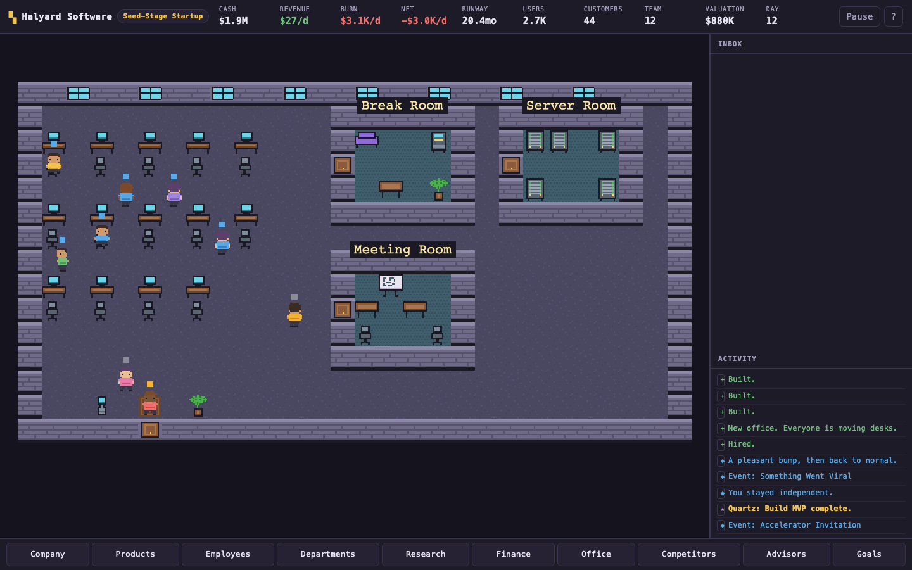

# Startup Tycoon

A long-form idle startup-management game with a live pixel-art office and persistent founder progression.

**[Play in your browser](https://startup-tycoon-yeny.netlify.app/)** · [Gameplay guide](docs/gameplay.md) · [Architecture](docs/architecture.md)



*A Scale-Up office during a pep talk, captured in a scripted playtest: people gather around the founder, the HUD shows work in flight and market trends, and a side-project event waits in the inbox. A new company starts in a garage.*

## Build a company, then a career

Start as a solo founder, ship products, hire a team and grow toward an exit —
then found another company with a different product, background and set of rules.
Each exit banks Founder Reputation for permanent upgrades, and finishing companies
opens up new starting products, founder backgrounds, markets and challenges.
A first company is designed to unfold over a working day of play.

- **Active and idle play:** manage in short check-ins, leave up to 16 hours of
  offline progress, use founder actions (keys Z–M) for short boosts, or play
  optional puzzles, including an investor pitch built from your real numbers.
- **A living office:** people work from the rooms that fit their job, huddle for
  standups, rush to the server room in an outage, celebrate hit launches, go home
  on leave and show what they are doing in pixel emote bubbles. Monitors light up
  where someone is working, and a crunch dims the lights.
- **People with stories:** employees roll readable traits (common, rare and
  legendary), get tired under a crunch, burn out, level up through job titles and
  keep a short personal history. The best of them can follow you to your next company.
- **Ten company shapes:** consumer apps, SaaS, developer tools, B2B, AI, enterprise,
  a consulting agency (cash now, valued low), a hit-driven game studio, a social
  network with network effects and a security-critical fintech app.
- **Launches, not just progress bars:** real launches roll as flops, hits or viral
  moments from quality, polish, the team's traits, marketing and the market.
- **A market that moves:** booms, downturns and recessions, category trends to ride
  or avoid, and nine rivals with personalities who launch, raise, start price wars,
  poach your people, sue, merge and fail — plus new entrants and a nemesis.
- **Strategic money:** each funding round offers different term sheets (a small
  round, a top-tier VC with a board target, a strategic investor), revenue-based
  loans for bootstrappers, and six exits from an acqui-hire to an IPO or a merger.
- **Organisation:** departments grow into named perks, the right mix unlocks
  synergies, research includes mutually exclusive company doctrines, and every
  office tier fits a limited number of rooms with upkeep.
- **Persistent progression:** 36 achievements, records, a hall of fame, 18 founder
  upgrade tracks, 9 founder backgrounds and 7 optional challenges. Versioned saves
  migrate older saves, import/export works, and exits and upgrades are transactional.

## Run locally

Use Node.js 24 and npm:

```sh
git clone https://github.com/Figo5/startup-tycoon.git
cd startup-tycoon
npm ci
npm run dev          # http://localhost:5180
npm run build        # static files in dist/
npm run preview      # preview the production build
```

No backend or account is required. Saves live in the browser's `localStorage`.
Use export/import to move progress between browsers.

## Architecture

JavaScript and Vite, with **Phaser for the office** and a **DOM management UI**.
`src/sim/` contains the simulation without Phaser or DOM dependencies;
`src/data/` contains content and tuning. The renderer reads state without deciding
cash, ownership or progression. Shared transaction paths prevent repeated exits,
purchases and achievements from awarding value twice.

See [architecture and save invariants](docs/architecture.md),
[gameplay and controls](docs/gameplay.md), [balance methodology](docs/balance.md) and
the [depth pass report](docs/development/depth-pass-report.md).

## Testing

```sh
npm test             # Node's built-in runner; no browser required
npm run build
npm run probe        # optional system-integration probe
```

Verified on 2026-09-25: **176 tests passed** (Node.js 22). In that environment the npm
registry was unreachable, so the production bundle was checked with Bun's bundler
against Phaser 3.90 rather than with `vite build`; see the
[depth pass report](docs/development/depth-pass-report.md) for the browser QA,
save-migration and balance evidence.

## Status and limits

A complete, playable single-player game. Desktop/laptop is the intended experience;
phones get a compact layout that works for check-ins. There is no audio, cloud save or multiplayer. Only one active
save tab is recommended: a second tab is warned, not blocked. Balance measurements
come from scripted policies, with later-run pacing still less well validated.

## License

No license file has been selected for this repository.
