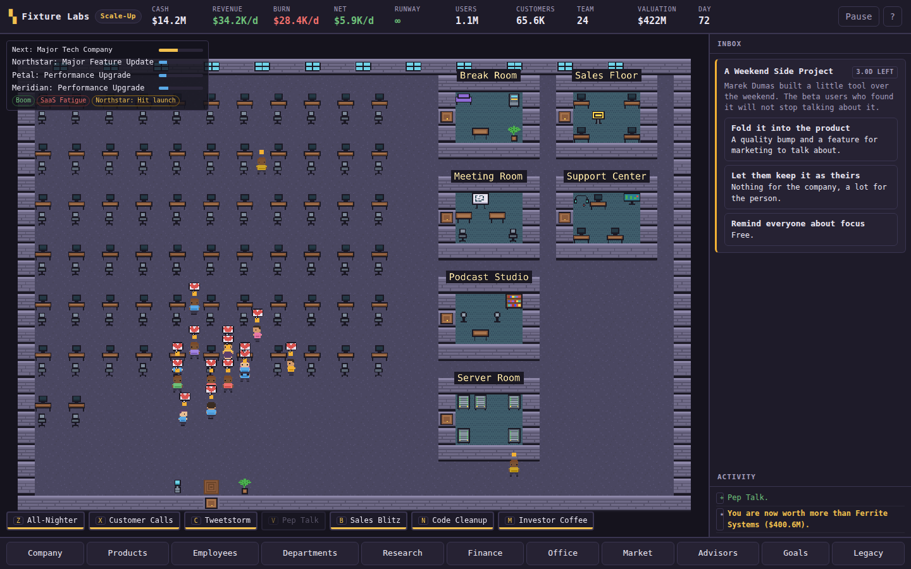
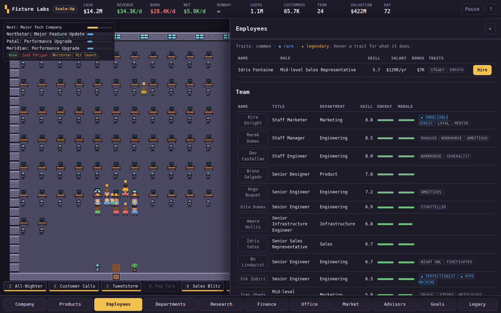
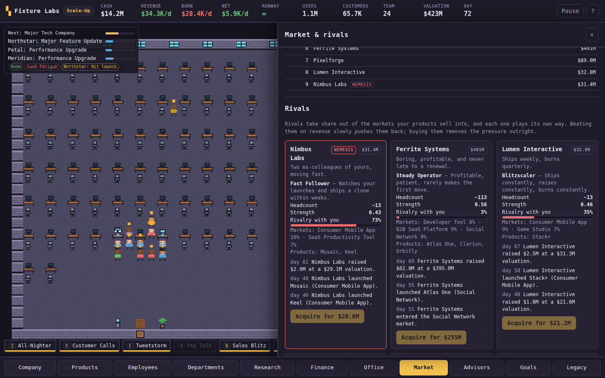
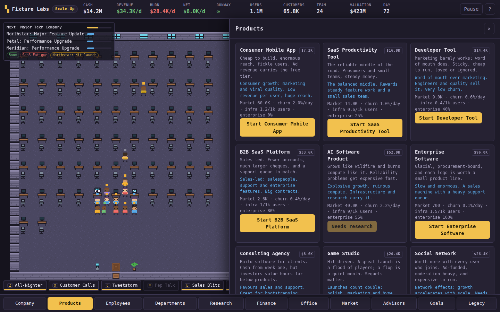
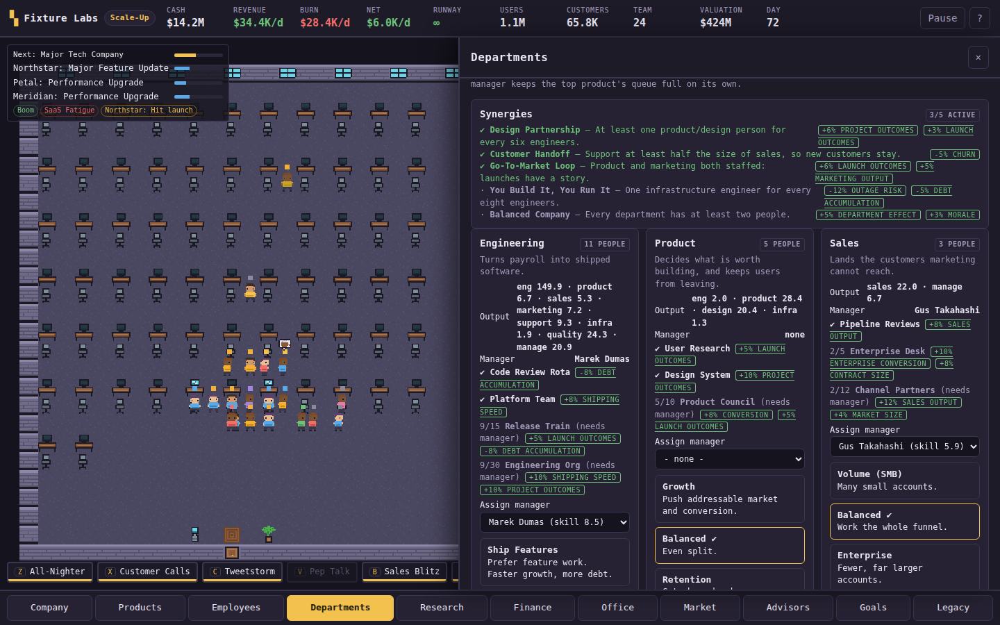
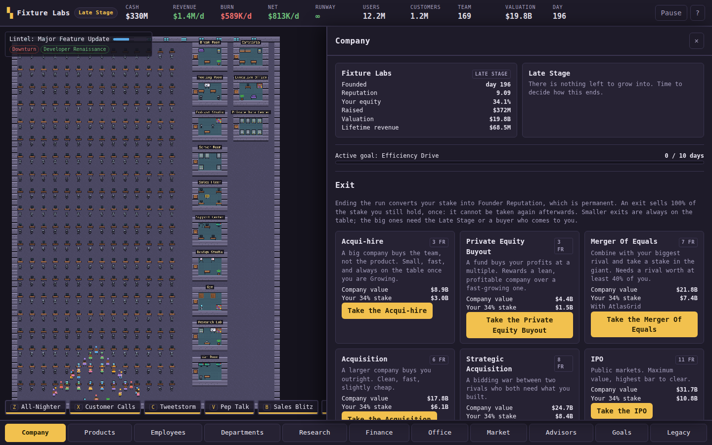
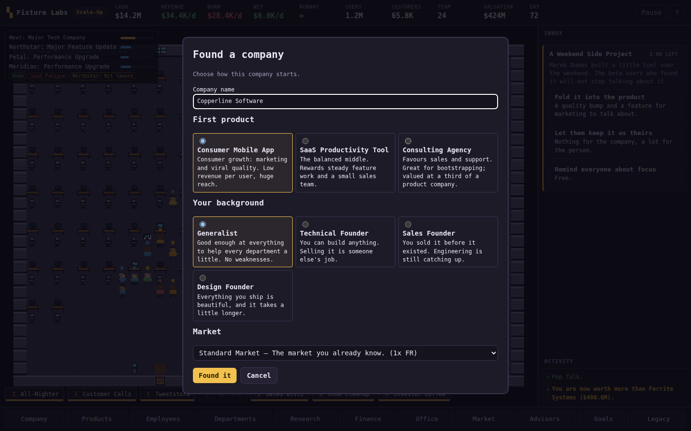
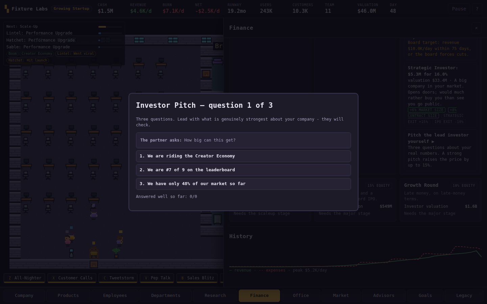
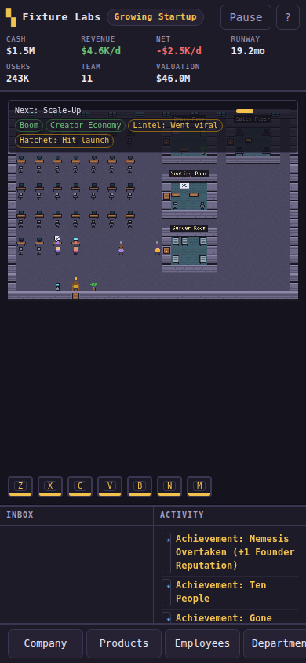

# Depth pass report (2026-09-25)

A long pass on the existing game to make it deeper, more replayable and better
suited to long sessions, without replacing its identity or restarting it.

## Starting point

Recovered from `main` at `ee8b2e7`: 156 passing tests, a working simulation with
6 product categories, 50 events, 7 coarse rivals (strength and share only), 3 exits,
14 prestige multiplier tracks and a pixel-art office where people wandered between
desks. Measured pacing (scripted operator): first exit at ~3.4 h active, ~5 h
moderate, ~11 h idle, and a second run shaped exactly like the first.

Weak links found by playing and measuring:

- A new company had one real decision (hire or not) for the first half hour.
- Shipping was a progress bar: every project silently added a few points.
- Employees were interchangeable numbers; nothing happened to people.
- Rivals only shrank as you grew; they never did anything.
- A funding round was a single yes/no; there was one kind of investor.
- Prestige was multipliers: the second company played like the first.
- The office looked the same whatever the company was doing.
- The balance tool's post-prestige section never took the first exit, so it always
  measured a second run with zero Founder Reputation.

## What changed

| Area | Before | After |
|---|---|---|
| Events | 50 | 99, with named subjects, 4 follow-up chains and 10 triggers |
| Product categories | 6 | 10 (consulting, games, social, fintech added) |
| Project types | 10 | 11, plus Rush / Standard / Polish approaches |
| Launches | none | flop / solid / hit / viral for real launches |
| Employee depth | skill, morale, specialty | + 20 traits in 3 rarities, energy, burnout, leave, titles, stories, alumni |
| Departments | priority + manager | + 19 headcount perks, 5 synergies |
| Active play | 3 event minigames | + investor pitch, 7 founder actions |
| Rooms | 8, unlimited | 13, per-tier slots and daily upkeep |
| Market | none | 4 economy phases, 14 category trends |
| Rivals | 7, strength and share | 9 with 7 personalities, valuations, launches, raises, price wars, poaching, lawsuits, consolidation, entrants, a nemesis, a leaderboard |
| Funding | 6 rounds, one offer each | up to 4 term sheets per round, board targets, strategic perks, revenue loans |
| Exits | 3 at Late Stage | 6 (acqui-hire, private equity, merger added) |
| Research | 35 | 50, including 4 exclusive doctrine pairs |
| Prestige | 14 tracks, 4 scenarios | 18 tracks, 9 backgrounds, 7 challenges, 36 achievements, records, hall of fame, co-founder carryover, unlockable starting products |
| Tests | 156 | 176 |

## Balance evidence

`npm run balance` (three seeds per profile), final:

| Profile | Seed stage | Scale-Up | First exit |
|---|---|---|---|
| Idle | ~2.0 h | ~6.5 h | 13.5–16.0 h |
| Moderate | ~1.2–1.4 h | ~2.8–3.0 h | 6.2–7.0 h |
| Active (minigames and founder actions) | ~0.8 h | ~2.0–2.1 h | 3.6–4.1 h |

Post-prestige: the first run banked ~30 Founder Reputation (exit plus one-time
achievements), which bought five upgrade levels; the second run took as long as
the first (13 FR), so later runs differ through choices rather than speed.
All 17 repeat-claim checks pass. Strategy comparisons and the exploits the
simulations caught are in [balance](../balance.md).

`npm run cadence`: 11.8 decisions per real hour (was 8.4); 6.8/h for a solo
founder rising to 16.4/h at the Late Stage.

## Browser QA

Performed in headless Chromium against a Bun-bundled build (Phaser 3.90), because
the sandbox could not download packages from the npm registry and so could not run
`vite build`. Every scripted check below passed with no page errors.

- **Fresh game, UI-driven.** Welcome screen → "Choose how to start" → SaaS +
  Technical founder → founder action → 107 game days of clicks (hiring, events,
  approach, marketing, founder actions). The first MVP flopped, which prompted
  raising first-launch goodwill.
- **Found a company / exit loop.** Late-stage company → IPO from the Company panel →
  exit summary → found the next company (consulting, technical, bootstrapped) →
  reload: company, background, challenge and Founder Reputation persist.
- **Pitch.** Growing company → Finance → pitch the lead investor → three answers →
  Series A closed at the pitched price.
- **Saves.** A genuine v4 save produced by the previous release (`ee8b2e7`) loads as
  v5, keeps its company, people and cash, gives nobody a trait, keeps simulating,
  and renders all eleven panels. Autosave + reload, export → reset all → import,
  and a two-hour absence (credited once, ~60 game days, not again on reload) pass.
- **Phone (390×844) and tablet (1024×700) layouts** checked; the phone layout was
  rebuilt during the pass.
- **Performance.** A 297-person campus runs at ~26 fps in headless software
  rendering, level with the previous release; a transparent full-screen overlay
  that cost ~30% of the frame budget was found and fixed.

Bugs found and fixed during QA: panels re-rendered under the cursor so clicks
could be lost; goals and achievements were written to the feed twice; the offline
summary reported game time as real time ("2.0 months" for two hours); duplicate
product names; "Senior Senior Engineer" titles; the Small Team challenge could not
pass Scale-Up; rivals consolidated until the leaderboard was empty.

## Screenshots

| | |
|---|---|
|  |  |
| Office during a pep talk | Traits, energy and titles |
|  |  |
| Economy, trends and the leaderboard | Approach, launches and trends on a product |
|  |  |
| Perks and synergies | Six exits at the Late Stage |
|  |  |
| Founding the next company | The investor pitch |
|  | |
| Phone layout | |

## Known limitations

- `vite build` was not run in this environment (npm registry blocked); the bundle
  was verified with Bun. The Netlify build still runs `npm run build`.
- Pacing is measured with scripted operators, not people. Idle play to a first exit
  is long (~14 h of check-ins every 30 minutes), by design for a long-session game.
- Rivals are still coarse: personality-driven moves on top of strength and share.
- Office behaviour is cosmetic and approximate; very large campuses are busy rather
  than legible.
- No audio.

## Future ideas

- Per-product rival matchups (a rival product you can see, beat or buy).
- Employee relationships beyond one-off feud/collaboration events.
- A launch-day active mode for major versions.
- Seasonal or weekly challenge seeds shared between players.
- A late-game conglomerate mode after a merger or IPO.
